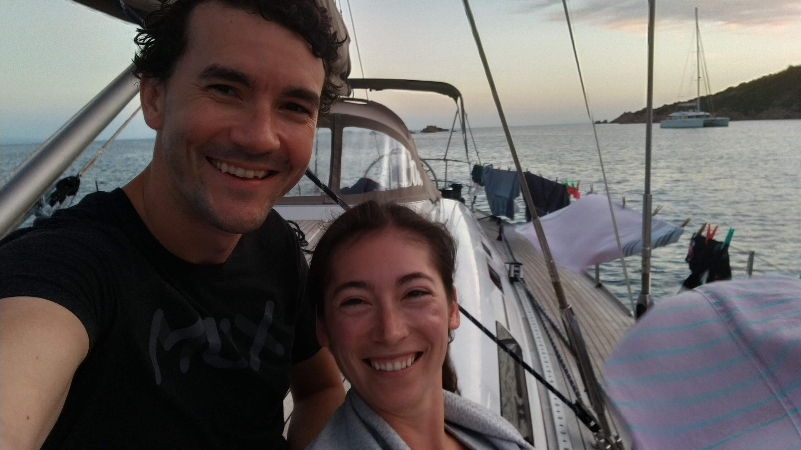
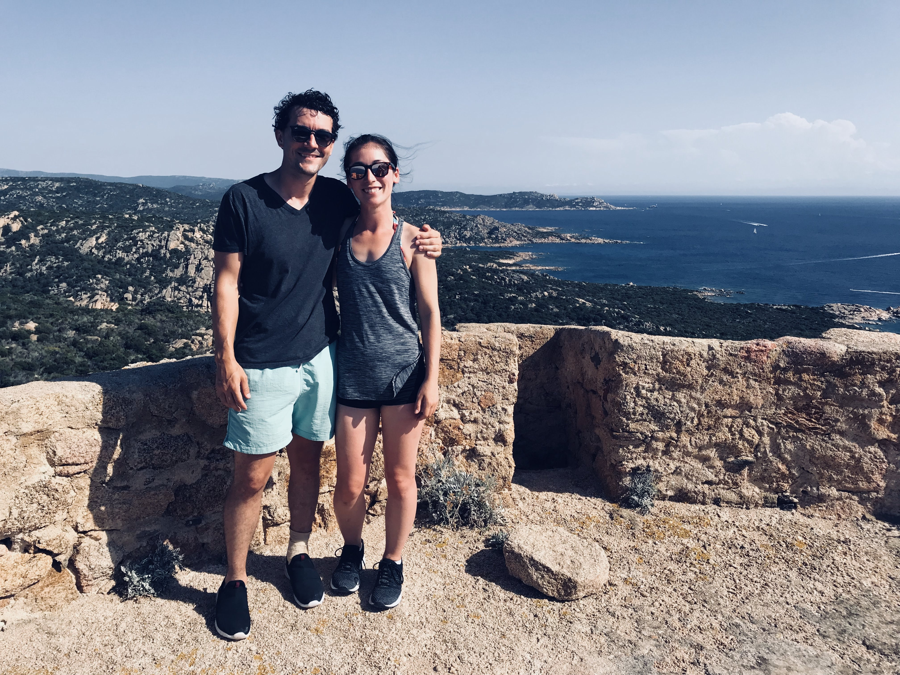
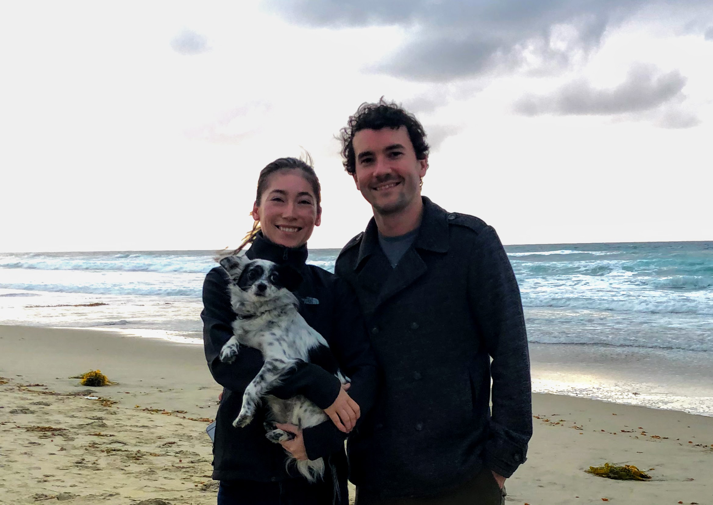

<center>

</center>
<br>
<p style="text-align: center;">
To my love, Matt,
<br>
Here is a data report of our overnight trips together from 2013 to February 14, 2019.
<br>
Your love,
Alex
</p>

```{r, echo = FALSE, warning = FALSE, message=FALSE}
#Loading packages and data. Creating map theme and helper date function
library(tidyverse)
library(ggplot2)
library(mapdata)
library(maps)
library(plotly)
library(mapproj)

trips = read_delim("trips.csv", delim = ",", col_types = "cciicccddc")
trips = trips %>% 
  mutate(start_date = as.Date(start_date, format = "%m/%d/%y"),
         end_date = as.Date(end_date, format = "%m/%d/%y"))
world = map_data("world")
us_states = map_data("state")

map_theme = theme(plot.title = element_text(hjust = 0.5),
                  axis.line=element_blank(),
                  axis.text.x=element_blank(),
                  axis.text.y=element_blank(),
                  axis.ticks=element_blank(),
                  axis.title.x=element_blank(),
                  axis.title.y=element_blank(),
                  panel.background=element_blank(),
                  panel.border=element_blank(),
                  panel.grid.major=element_blank(),
                  panel.grid.minor=element_blank(),
                  plot.background=element_blank())

as.Date_origin <- function(x){
  format(as.Date(x, origin = '1970-01-01'), "%Y")
}
```
<br>
<center>

</center>
<br>
<br>

###World Map of our Trips
All our overnight trips since 2013, colored by the date, and sized by the number of days we spent in that location. Click and drag to zoom. Double click to zoom out. Hover over each dot for details :)
```{r, warning = FALSE, message=FALSE}
p = ggplot()+
  geom_polygon(data = world, 
               aes(x = long, 
                   y = lat, 
                   group = group))+
  geom_point(data = trips,
             aes(x = longitude,
                 y = latitude,
                 color = as.integer(start_date),
                 text = paste('</br>city: ', city,
                              '</br>date: ', start_date,
                              '</br>days: ', days,
                              '</br>memory: ', memory)),
             size=trips$days/2)+
  scale_color_gradientn(name = "Year", colors = rainbow(7), labels = as.Date_origin)+
  coord_map()+
  map_theme
ggplotly(p, tooltip = c("text"))
```

<center>

</center>

###Detail of United States
```{r, warning = FALSE, message=FALSE}
usa_trips = trips %>% filter(country == "USA")
p = ggplot()+
  geom_polygon(data = us_states,
               aes(x = long,
                   y = lat,
                   group = group))+
  geom_point(data = usa_trips,
             aes(x = longitude,
                 y = latitude,
                 color = as.integer(start_date),
                 text = paste('</br>city: ', city,
                              '</br>date: ', start_date,
                              '</br>days: ', days,
                              '</br>memory: ', memory)),
             size=usa_trips$days/2)+
  scale_color_gradientn(name = "Year", colors = rainbow(7), labels = as.Date_origin)+
  coord_map()+
  map_theme
ggplotly(p, tooltip = c("text"))

```

<center>

</center>

###Detail of Southern Africa
```{r, warning = FALSE, message=FALSE}
p = ggplot()+
  geom_polygon(data = world, 
               aes(x = long, 
                   y = lat, 
                   group = group))+
  geom_point(data = trips,
             aes(x = longitude,
                 y = latitude,
                 color = as.integer(start_date),
                 text = paste('</br>city: ', city,
                              '</br>date: ', start_date,
                              '</br>days: ', days,
                              '</br>memory: ', memory)),
             size=trips$days/2)+
  scale_color_gradientn(name = "Year", colors = rainbow(7), labels = as.Date_origin)+
  #coord_map(projection = "mecca", lat0 = 100, xlim = c(12,37), ylim = c(-37,-22))+
  coord_map(xlim = c(12,37), ylim = c(-37,-22))+
  map_theme
ggplotly(p, tooltip = c("text"))
```

<center>

</center>

###Detail of Europe
```{r, warning = FALSE, message=FALSE}
p = ggplot()+
  geom_polygon(data = world, 
               aes(x = long, 
                   y = lat, 
                   group = group))+
  geom_point(data = trips,
             aes(x = longitude,
                 y = latitude,
                 color = as.integer(start_date),
                 text = paste('</br>city: ', city,
                              '</br>date: ', start_date,
                              '</br>days: ', days,
                              '</br>memory: ', memory)),
             size=trips$days/2)+
  scale_color_gradientn(name = "Year", colors = rainbow(7), labels = as.Date_origin)+
  ylim(-55,NA)+
  coord_map(xlim = c(-10,20), ylim = c(40,50))+
  map_theme
ggplotly(p, tooltip = c("text"))
```

<center>

</center>

#### How many days have we spent on trips in each state in the USA vs abroad?
```{r, warning = FALSE, message=FALSE}
state_days_tally = trips %>% group_by(state) %>% summarize(total_days = sum(days))
p = ggplot(data = state_days_tally)+
  geom_bar(stat = "identity",
           aes(x = state,
                 y = total_days,
               fill = state == "Abroad"))+
  scale_fill_manual(values = c("skyblue","steelblue4"))+
  xlab("State")+
  ylab("Days")+
  theme(axis.text.x = element_text(angle = 45, vjust = 0.5),
        legend.position = "none")
p
```

Most of our overnights have been, unsurprisingly, in California, followed by overnights abroad, a little surisingly since we've only been on two overseas trips! Georgia comes in third, where your family lives, and has also been the location of several weddings. Most other states we have visited to see family or attend weddings. DC and Florida were friend-reunion trips with my college friends. 

<center>

</center>

###Length and Type of Trip
Did we go on more trips the longer we were together? Did we go to more weddings? More international trips?
```{r, echo = FALSE, warning = FALSE, message=FALSE}
total_length_trips = trips %>% mutate(wedding = grepl("wedding",memory)) %>% filter(total_trip_days >=1)
p = ggplot(data = total_length_trips)+
  geom_bar(stat = "identity",
           aes(x = start_date,
               y = total_trip_days,
               fill = wedding),
           width = 10)+
  scale_fill_manual(values = c("skyblue","purple"), labels = c("Not wedding", "Wedding"))+
  scale_x_date(date_breaks = "1 year", date_minor_breaks = "4 months", date_labels = "%Y")+
  xlab("Trip Date")+
  ylab("Days")+
  theme(legend.title = element_blank())
p
```

We've gone to one or two weddings every year except for 2016, with no weddings. We started out with 3 day long weekend trips in 2014, and then went on more weeklong trips in 2015 and 2016. Since 2017 we've gone on fewer weeklong trips, but we have taken a long >2 week international trip each summer, along with shorter trips. 

###Length of Trip by Time of Year
Do we go on more trips during a certain time of the year?
```{r, echo = FALSE, warning = FALSE, message=FALSE}
total_length_trips_month = trips %>% mutate(wedding = grepl("wedding",memory)) %>% filter(total_trip_days >=1) %>% mutate(start_date = format(start_date,"%m"))

p = ggplot(data = total_length_trips_month)+
  geom_jitter(aes(x = start_date,
               y = total_trip_days,
               color = as.integer(end_date),
                 text = paste('</br>city: ', city,
                              '</br>date: ', start_date,
                              '</br>days: ', days,
                              '</br>memory: ', memory)),
              width = 0.1)+
  scale_color_gradientn(name = "Year", colors = rainbow(7), labels = as.Date_origin)+
  xlab("Month")+
  ylab("Days")
ggplotly(p, tooltip = c("text"))
```

It seems we take weekend trips January through March, with fewer but longer trips in the summer. Since 2014 we have only taken 1 trip together in May and August! 

<center>

</center>
<p style="text-align: center;">Here's to many more adventures in the years ahead!<br>
I love you</p>
